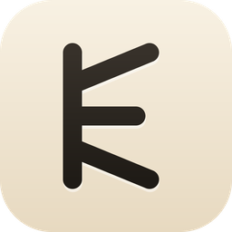

<div align="center">



# Skald

**Your meetings. Your machine. Your notes.**

A local-first AI meeting assistant for macOS. It listens, transcribes, and writes
the notes up — on your own hardware, into plain Markdown files you own.

[](https://github.com/BryanParreira/Skald/releases/latest)
[](LICENSE)
[](https://github.com/BryanParreira/Skald/releases/latest)

</div>

---

A *skald* was the Norse court poet whose job was to listen to what happened and
turn it into something worth keeping. That is the whole idea.

No bot joins your call. Skald captures the audio your Mac is already playing and
recording, so it works with Zoom, Meet, Teams, or two people talking across a
table — with nothing to invite and nobody else in the room.

## Install

**[Download the latest release →](https://github.com/BryanParreira/Skald/releases/latest)**

Requires macOS 14.2 or later, Apple silicon. Grant microphone and system-audio
permission on first launch; the app walks you through it.

## What it does

**Transcribes without sending audio anywhere.** Run it fully on-device, or point
it at a cloud transcriber if you would rather. Built-in support for Deepgram,
AssemblyAI, Soniox, Gladia, ElevenLabs, Cartesia, Fireworks, Mistral, OpenAI,
pyannote, Cloudflare Workers AI, Aquavoice, local Ollama, or any custom endpoint.

**Writes notes with whatever model you trust.** Bring your own key for OpenAI,
Anthropic, Google, Mistral, OpenRouter, Azure OpenAI, Azure AI Foundry or
Cloudflare — or keep it entirely offline with Ollama, LM Studio, or a local GGUF
you download from inside the app (Llama 3.2 3B, Gemma 3 4B, Qwen 2.5 3B).

**Keeps everything as files.** Every session is a `.md` file in a folder you
choose. Read it, grep it, sync it with iCloud, Dropbox, Syncthing or git. There
is no proprietary database to escape from and no export button to hunt for.

**Stays out of the way.** Lives in the menu bar, follows your calendar, and can
pull task context from GitHub while you work.

## Privacy

This is the part worth being precise about, so here is exactly what happens.

| | |
|---|---|
| **Analytics** | None. The analytics client is built without a key, so every event is a no-op and nothing leaves the device. |
| **Crash reporting** | None. Release builds ship without a Sentry DSN. |
| **Account** | Not required. There is no sign-up step and no login wall — install it and start. |
| **Audio** | Never uploaded when you use an on-device transcriber. If you pick a cloud provider, audio goes to that provider under your own API key. |
| **Notes** | Local files on your disk, in a directory you pick. |
| **AI requests** | Go straight from your machine to the provider you configured. They are not proxied through any server of ours. |

The honest caveat: choosing a cloud transcriber or a hosted model means your data
goes to *that vendor*, on your key and their terms. Skald does not add a hop, but
it cannot make a remote API local.

## Build it yourself

Requires [Rust](https://rustup.rs), [Node 22+](https://nodejs.org), and
[pnpm](https://pnpm.io).

```bash
pnpm install
pnpm -F @skald/desktop tauri:dev     # run in development
pnpm -F desktop tauri:build          # produce a .app and .dmg
```

Useful checks:

```bash
pnpm -r typecheck      # TypeScript
cargo check            # Rust
pnpm exec dprint fmt   # formatting
```

More detail in [AGENTS.md](AGENTS.md) and [CONTRIBUTING.md](CONTRIBUTING.md).

## Under the hood

Tauri shell with a Rust core and a React front end. TinyBase holds the data,
Zustand the UI state, TipTap the editor. Audio capture, transcription, diarization
and the local model runtime are Rust crates under [`crates/`](crates/); the
platform glue lives in [`plugins/`](plugins/).

## License

[MIT](LICENSE). Skald is a fork of [Hyprnote](https://github.com/fastrepl/hyprnote)
by Fastrepl, Inc., whose copyright notice the license retains. Fork it, change it,
ship it.

---

<div align="center">
Maintained by <a href="https://github.com/BryanParreira">BryanParreira</a>
</div>
